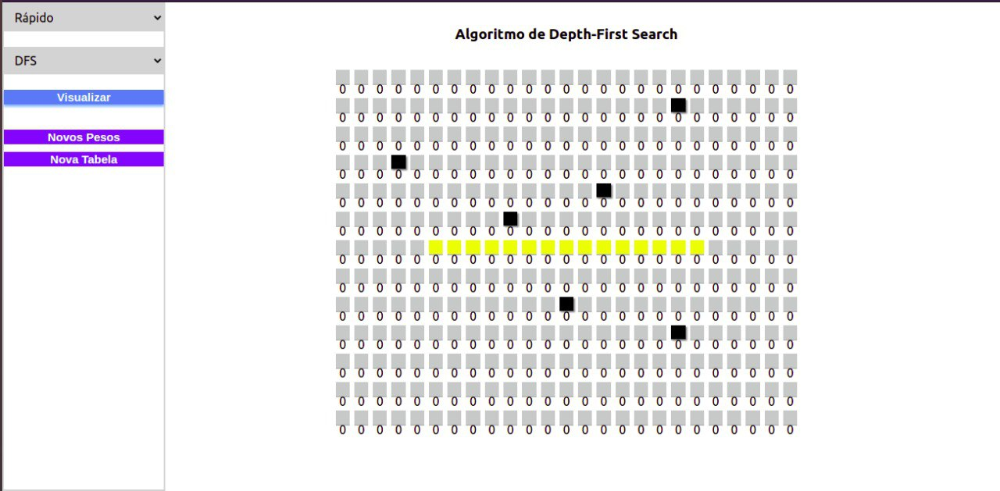
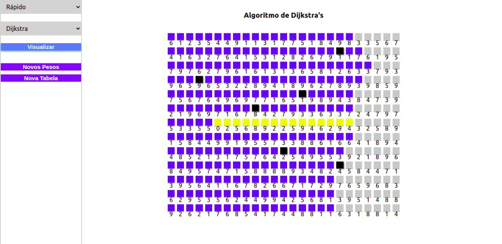
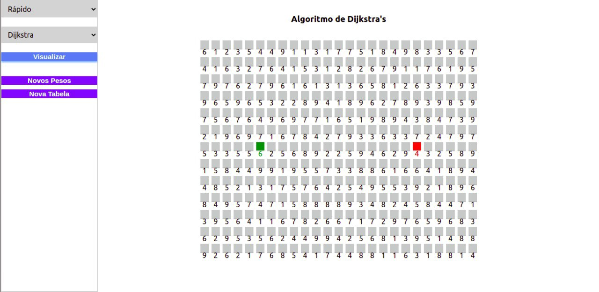

# Dora Aventureira

**Número da Lista**: X<br>
**Conteúdo da Disciplina**: Entrega Final<br>

## Alunos
Matrícula | Aluno |
| -- | -- |
| 17/0013651  |  João Gabriel Antunes |
| 16/0132550  |  Lorrany Azevedo |

## Sobre 
O projeto tem o objetivo de entregar visualização de alguns algoritmos aplicados a encontrar caminhos mais proximos. Aqui nós implementamos a busca pos Djikstra e DFS.

## Screenshots




## Instalação 
**Linguagem**: TypeScript<br>
**Framework**: React<br>
Para rodar o projeto, é preciso possuir React e o TypeScript instalados.

## Uso 
Para rodar o projeto siga as instruções abaixo:
```bash
cd Final_DoraAventureira/pathfinder
yarn install
yarn start
```
Caso falte algum pacote necessário para a execução basta rodar yarn add {nome_do_pacote}.

## Outros 
Quaisquer outras informações sobre seu projeto podem ser descritas abaixo.


